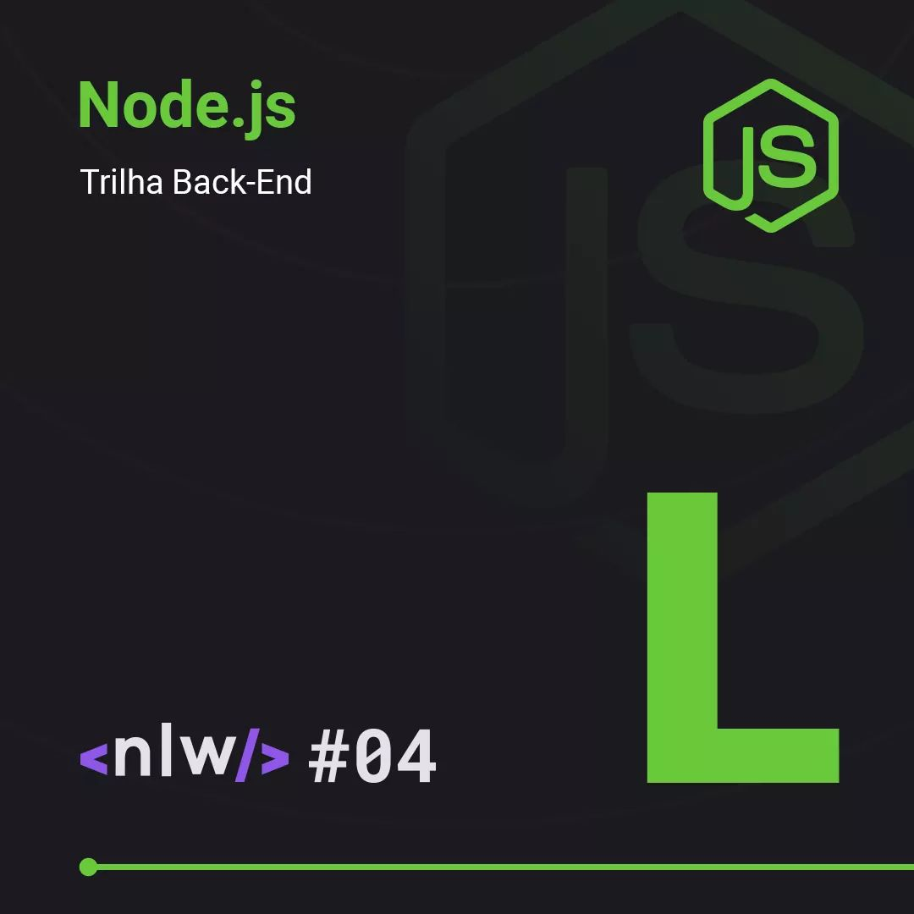

<h1 align="center">Next Level Week 04 - NPS API</h1>

<h2 align="center">
    
</h2>

 

    

    Next Level Week is an event driven by <a target="_blank" href="https://rocketseat.com.br/">Rocketseat</a> to build an application from scratch. The project consists in a NPS (Net Promoter Score) API.

    <a href="#-technologies">Technologies</a>
    &nbsp;|&nbsp;
    <a href="#-license">License</a>

## 🛠️ Technologies

This project is being developed with the following technologies:

- [Node.js](https://nodejs.org/en/)
- [Express](https://expressjs.com/pt-br/)
- [Yarn](https://yarnpkg.com/)
- [TypeORM](https://typeorm.io/)

## 📝️ License

This project is under the MIT license. See the [LICENSE](LICENSE) file for more details.

 

 
    <h2 align="center">🚧️ Project under construction 🚧️</h2>
</p